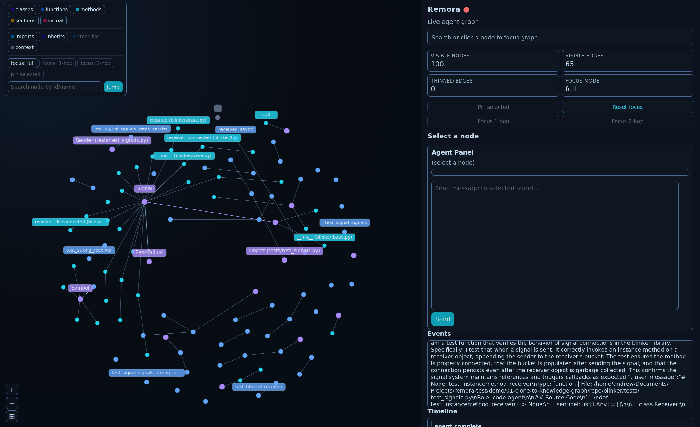

# Remora v2

Remora is a reactive agent substrate where discovered nodes (functions, classes,
methods, markdown sections, TOML tables, directories, virtual agents) are
represented and executed as autonomous agents.

Key capabilities in this refactor:
- Multi-language tree-sitter discovery (`.py`, `.md`, `.toml`) with query overrides
- Incremental `FileReconciler` for startup scan + continuous add/change/delete sync
- Event-driven runner with bundle-in-workspace tooling and proposal approval flow
- Web graph surface with SSE streaming
- Typer CLI (`remora start`, `remora discover`, `remora index`, `remora lsp`)
- Optional LSP adapter for code lens / hover / save/open event forwarding (start with `remora start --lsp`)

Configuration highlights in `remora.yaml`:
- `discovery_paths`: directories/files to scan
- `language_map`: extension -> language mapping for discovery
- `query_search_paths`: override directories for `*.scm` tree-sitter queries

## Demo Example

