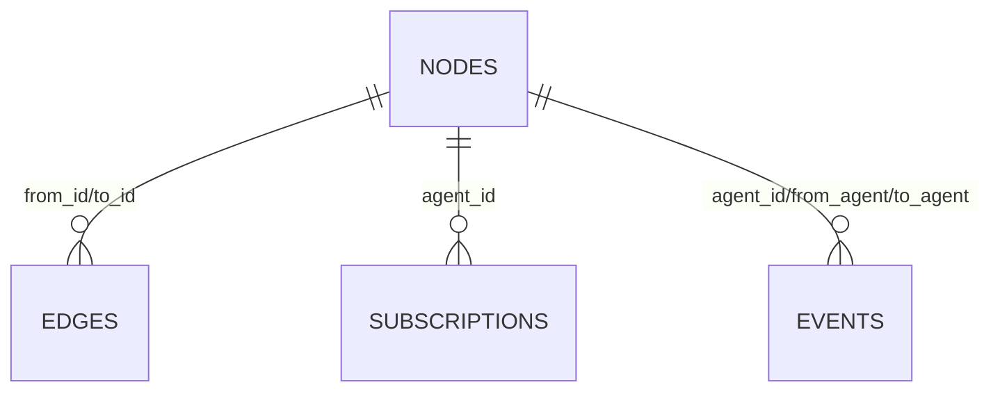

# Remora Architecture

## Table of Contents

1. System Overview
2. Component Inventory
3. Data Model
4. Event Flow
5. Actor Lifecycle
6. Workspace and Tool Execution
7. Extension Points

## 1. System Overview

Remora is an event-driven runtime that maps source-code structure into a live graph of autonomous agents.

Core data flow:

```text
Source Files -> FileReconciler -> NodeStore -> ActorPool -> Actor -> EventStore
                                                           |
                                                           v
                                                  EventBus + TriggerDispatcher
                                                           |
                                                           v
                                                   Web (SSE) / LSP / CLI
```

Reactive loop:

1. A file is discovered or changes.
2. Reconciler updates node projections and emits node/content events.
3. Subscriptions match events to target agents.
4. ActorPool enqueues events into actor inboxes.
5. Actor executes a turn (prompt + tools + model).
6. Turn outputs emit more events.
7. Web/LSP clients observe state through APIs and SSE.

## 2. Component Inventory

### CLI and Boot

- File: `src/remora/__main__.py`
- Responsibility: process startup, config loading, lifecycle coordination, optional web/LSP startup.
- Depends on: `RuntimeServices`, `create_app`, `create_lsp_server`, `open_database`.
- Notable behavior: graceful shutdown sequencing for reconciler, actor pool, and web server.

### RuntimeServices

- File: `src/remora/core/services/container.py`
- Responsibility: dependency container and ownership of core service instances.
- Creates: `NodeStore`, `EventStore`, `EventBus`, `SubscriptionRegistry`, `TriggerDispatcher`, `CairnWorkspaceService`, `ActorPool`, `FileReconciler`, `Metrics`.

### Reconciler

- File: `src/remora/code/reconciler.py`
- Responsibility: keep graph projection synchronized with the filesystem.
- Emits: `NodeDiscoveredEvent`, `NodeChangedEvent`, `NodeRemovedEvent`.
- Subscribes to: `ContentChangedEvent` for immediate targeted reconciliation.
- Handles: directory materialization, virtual agent materialization, bundle provisioning, subscription refresh.
- Lifecycle: `start(event_bus)` subscribes exactly once; `stop()` unsubscribes and is safe to call repeatedly.

### Stores

- `NodeStore` (`src/remora/core/storage/graph.py`): nodes + edges projection tables.
- `EventStore` (`src/remora/core/events/store.py`): append-only event log, fan-out to bus + dispatcher.
- `SubscriptionRegistry` (`src/remora/core/events/subscriptions.py`): pattern-based routing metadata.

### Dispatch and Execution

- `EventBus` (`src/remora/core/events/bus.py`): in-process pub/sub + stream API.
- `TriggerDispatcher` (`src/remora/core/events/dispatcher.py`): subscription matching + router callback.
- `ActorPool` (`src/remora/core/agents/runner.py`): actor lifecycle, routing, idle eviction.
- `Actor` (`src/remora/core/agents/actor.py`): inbox loop and turn dispatch.
- `AgentTurnExecutor` (`src/remora/core/agents/turn.py`): prompt assembly, tool loading, model invocation, completion/error events.

### Workspace and Tools

- `CairnWorkspaceService` (`src/remora/core/storage/workspace.py`): per-agent workspace lifecycle and bundle materialization.
- `GrailTool` + discovery (`src/remora/core/tools/grail.py`): loads `_bundle/tools/*.pym`, wraps execution in structured tool interface.
- `TurnContext` (`src/remora/core/tools/context.py`): external API injected into tools.

### Frontends

- Web server (`src/remora/web/server.py`): REST endpoints + SSE stream.
- LSP server (`src/remora/lsp/server.py`): CodeLens/Hover + content-change event emission.
- CORS policy: no CORS headers are emitted by default; browser cross-origin mutating
  requests are intentionally blocked for localhost-only operation.

## 3. Data Model

Remora uses SQLite with WAL mode (`open_database` in `src/remora/core/storage/db.py`).

### `nodes`

Primary node projection table.

Key columns:

- `node_id` (PK)
- `node_type`, `name`, `full_name`
- `file_path`, `start_line`, `end_line`, `start_byte`, `end_byte`
- `text`, `source_hash`
- `parent_id`, `status`, `role`

Indexes: by type, file, status, parent.

### `edges`

Directed graph relationships.

- `id` (PK)
- `from_id`, `to_id`, `edge_type`
- unique constraint on `(from_id, to_id, edge_type)`

Indexes: `from_id`, `to_id`.

### `events`

Append-only event log.

- `id` (PK, autoincrement)
- `event_type`
- `agent_id`, `from_agent`, `to_agent`
- `correlation_id`, `timestamp`
- `payload` (JSON text), `summary`

Indexes: event type, agent, correlation.

### `subscriptions`

Routing patterns for trigger dispatch.

- `id` (PK)
- `agent_id`
- `pattern_json`
- `created_at`

Index: `agent_id`.

### ER Diagram



## 4. Event Flow

Representative built-in event types and default producers/consumers:

- `NodeDiscoveredEvent`
  - Emitted by: `FileReconciler`
  - Typical subscribers: agents with matching subscriptions or direct messages
- `NodeChangedEvent`
  - Emitted by: `FileReconciler` on hash change
  - Triggers: reactive analysis turns
- `NodeRemovedEvent`
  - Emitted by: `FileReconciler`
- `ContentChangedEvent`
  - Emitted by: LSP save/open, rewrite tools
  - Triggers: file-level and directory-level subscriptions
- `AgentStartEvent` / `AgentCompleteEvent` / `AgentErrorEvent`
  - Emitted by: `Actor`
  - Consumed by: observability/UI and any subscribers
- `AgentMessageEvent`
  - Emitted by: tools (`send_message`, `broadcast`) and `/api/chat`
  - Triggers: direct agent turns (`to_agent` subscriptions)
- `CustomEvent`
  - Emitted by: `event_emit` external

Subscription matching supports:

- Event type filters
- Sender filters (`from_agents`)
- Direct target (`to_agent`)
- Path globs (`path_glob`) against `path`/`file_path`

## 5. Actor Lifecycle

1. ActorPool receives a routed event and lazily creates an actor if needed.
2. Event enters actor inbox.
3. Actor applies cooldown/depth guard.
4. Actor transitions node status to `running`.
5. Actor builds prompt context, loads tools, and calls kernel.
6. Actor emits completion or error events.
7. Actor transitions status back to `idle` (or `error` on failure).
8. Idle actors are evicted after inactivity.

Turn controls:

- Shared semaphore limits concurrent turns (`max_concurrency`).
- Depth tracking enforces `max_trigger_depth` per correlation ID.
- Cooldown enforces `trigger_cooldown_ms`.
- Actor inboxes are bounded (`actor_inbox_max_items`) with explicit overflow policy:
  `drop_new`, `drop_oldest`, or `reject`.
- Overflow behavior is observable via metrics:
  `actor_inbox_overflow_total`, `actor_inbox_dropped_oldest_total`,
  `actor_inbox_dropped_new_total`, `actor_inbox_rejected_total`.

## 6. Workspace and Tool Execution

Each agent gets a workspace under `.remora/agents/<safe-id>`.

Provisioning behavior:

- Merge `bundle.yaml` overlays from `system` then role bundle.
- Copy role/system `.pym` tools to `_bundle/tools/`.
- Track bundle fingerprint in KV to avoid unnecessary copies.

Tool execution flow:

1. Actor builds `TurnContext` for current node/correlation.
2. `discover_tools()` loads `_bundle/tools/*.pym` via Grail.
3. `GrailTool` exposes each script as a structured tool.
4. Tool call executes script with injected externals.
5. Externals perform graph/file/event side effects.

## 7. Extension Points

### Add a New Event Type

1. Add a model in `src/remora/core/events/types.py`.
2. Export in `src/remora/core/events/__init__.py`.
3. Emit from the relevant subsystem.
4. Optionally add default subscription registrations.

### Add a New Language

1. Extend `language_map` in config.
2. Provide parser/query support under configured `query_search_paths`.
3. Validate discovery output via `remora discover`.

### Add a New Bundle

1. Create `bundles/<name>/bundle.yaml`.
2. Add optional `tools/*.pym` scripts.
3. Map node types in `bundle_overlays` or assign via role.

### Add a New API Endpoint

1. Add handler in `src/remora/web/routes/<feature>.py` (or extend an existing route module).
2. Register `Route(...)` in that module and include it via `_build_routes()` in `src/remora/web/server.py`.
3. Add/extend unit tests in `tests/unit/test_web_server.py`.

### Add a New External Function

1. Implement method on `TurnContext`.
2. Export it in `to_capabilities_dict()`.
3. Add unit coverage in `tests/unit/test_externals.py`.
4. Document it in `docs/externals-api.md`.
